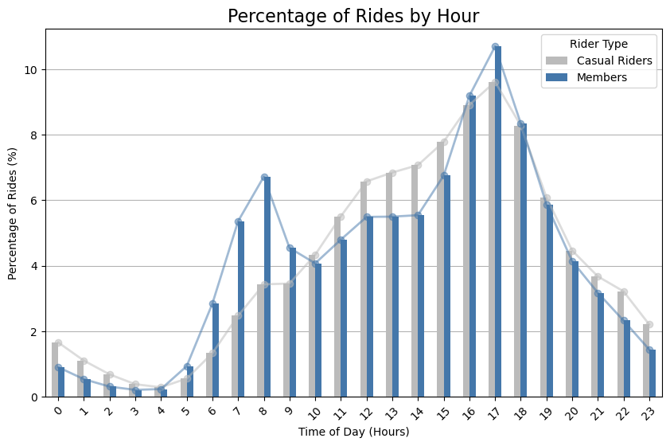
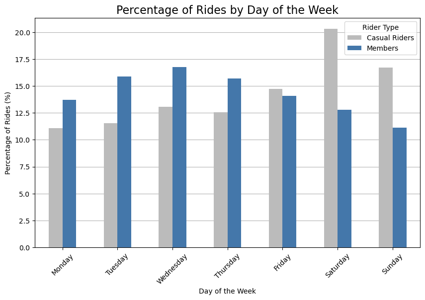
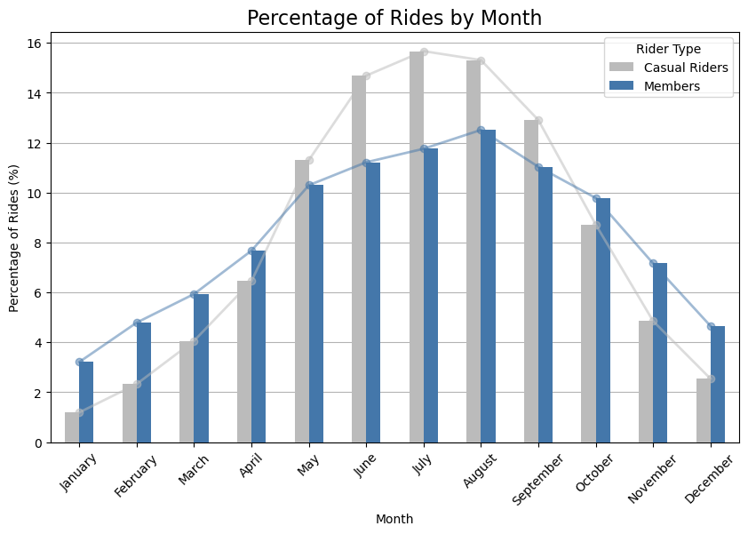
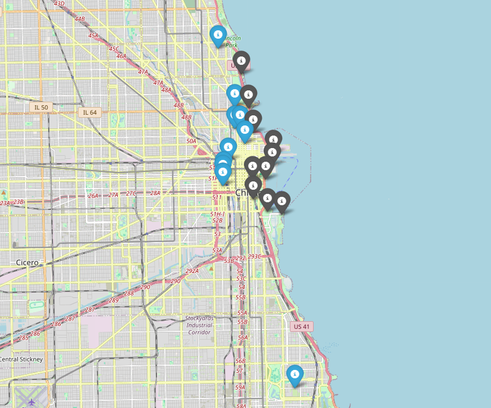
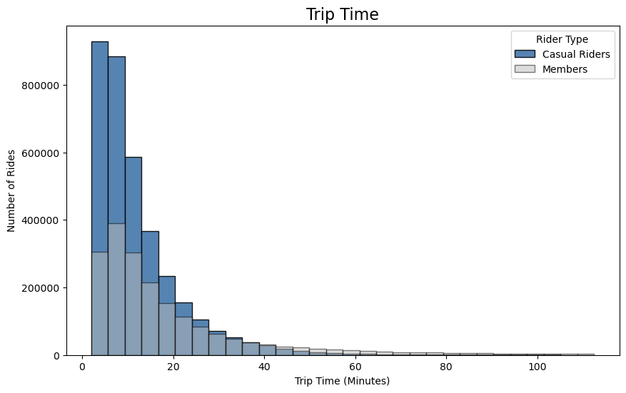
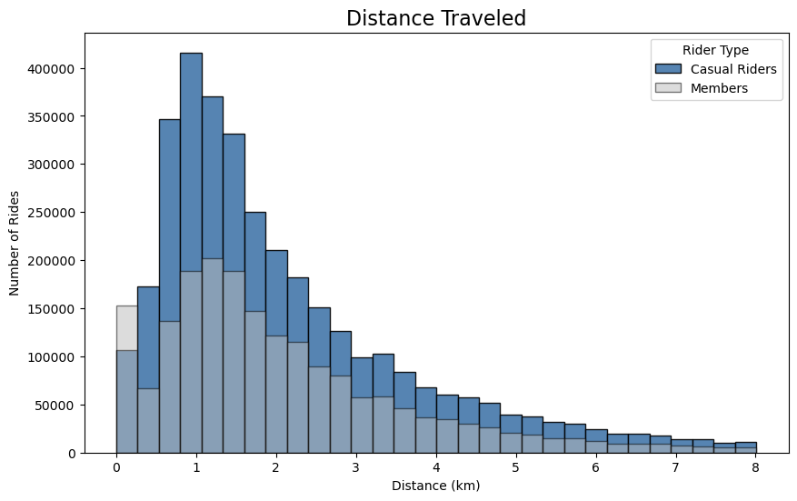

# Cyclistic Bike Share Case Study
## Google Data Analytics Course Capstone Project  

The **Cyclistic Bike Share Case Study** is a capstone project for the **Google Data Analytics Professional Certificate** on Coursera. In this project, use the skills I have learnt from the course, as well as applying some of my own Python and Pandas skills, to complete this capstone project. The goal of this project is to analyze publicly available ride data to generate insights on ridership patterns and differences between casual riders and members.  

## Table of contents
- [Table of contents](#table-of-contents)
- [Contents and Usage](#contents-and-usage)
- [Required Software and Packages](#required-software-and-packages)
- [Project Background](#project-background)
- [Business Task](#buisness-task)
- [Data Sources](#data-sources)
- [Data Cleaning and Processing Methodology](#data-cleaning-and-processing-methodology)
- [Analysis Summary](#analysis-summary)

## Contents and Usage

The following repository is composed of mainly notebooks detailing the whole data analysis process, from data preperation, exploration, cleaning, transformation, analysis, and visualization. There are three notebooks, each focusing on different stages of the data cycle. The code within the notebooks is a mix of Python and SQL, but the SQL queries are made inside a Python enviroment with the usage of packages to conenct to a local MySQL server. The order is as follows:

1. `data_preperation.ipynb` — Data Preperation (Pandas and SQL)
2. `data_cleaning.ipynb` — Data Exploration, Data Cleaning (SQL)
3. `data_analysis.ipynb` — Data Transformation, Data Analysis, Data Visualization (Pandas, Matplotlib)

## Required Software and Packages

Since data will be stored on a local MySQL server, a working version of MySQL will need to be installed on your device to run the code in these notebooks. To download, visit [this download page](https://dev.mysql.com/downloads/mysql/).

There are also required Python packages to run the notebook codeblocks. Here are the list of required packages to be installed:

- NumPy
- Pandas
- Folium
- Matplotlib
- ipython-sql
- PyMySQL
- SQLAlchemy

##### Anaconda Installation
```
conda install numpy pandas folium matplotlib ipython-sql pymysql sqlalchemy
```

##### pip Installation
```
pip install numpy pandas folium matplotlib ipython-sql pymysql sqlalchemy
```

## Project Background
In 2016, Cyclistic launched a successful bike-share offering. Since then, the program has grown
to a fleet of 5,824 bicycles that are geotracked and locked into a network of 692 stations
across Chicago. The bikes can be unlocked from one station and returned to any other station
in the system anytime.

Until now, Cyclistic’s marketing strategy relied on building general awareness and appealing to
broad consumer segments. One approach that helped make these things possible was the
flexibility of its pricing plans: single-ride passes, full-day passes, and annual memberships.
Customers who purchase single-ride or full-day passes are referred to as casual riders.
Customers who purchase annual memberships are Cyclistic members.

Cyclistic’s finance analysts have concluded that annual members are much more profitable
than casual riders. Although the pricing flexibility helps Cyclistic attract more customers,
the marketing director believes that maximizing the number of annual members will be key to future growth.
Rather than creating a marketing campaign that targets all-new customers, the marketing director believes
there is a solid opportunity to convert casual riders into members. She notes that casual riders
are already aware of the Cyclistic program and have chosen Cyclistic for their mobility needs.

The marketing director has set a clear goal: Design marketing strategies aimed at converting casual riders into
annual members. In order to do that, however, the team needs to better understand how
annual members and casual riders differ, why casual riders would buy a membership, and how
digital media could affect their marketing tactics. The marketing director and their team are interested in
analyzing the Cyclistic historical bike trip data to identify trends.

## Buisness Task

**Using Cyclistic's bike trip data from the past year, identify key differences in ridership behaviour between casual riders and members. The main objective is to use the data to develope actionable insights to inform marketing strategies aimed at increasing the number of members by targeting casual riders.**

## Data Sources

The data was obtained from an [online database](https://divvy-tripdata.s3.amazonaws.com/index.html), and the data is made avaible by Motivate International Inc. under this [license](https://divvybikes.com/data-license-agreement). I have downloaded the ridershare data from the past 12 months (August 2023 - July 2024). The code in this notebook is compatible with data from past or future time frames.

## Data Cleaning and Processing Methodology

The data cleaning and processing was mostly done in SQL. In the `data_preperation.ipynb` notebook, the data from each month was first combined into one larger dataframe and put onto a local MySQL server. 

In the `data_cleaning.ipynb` notebook, I used SQL queries to explore the general structure of the data, and cleaned the data by converting column data types, interpreting null values, and removing invalid data, ensuring the data is prepared to be used for efficient and accurate data analysis. 

In the `data_analysis.ipynb` notebook, new columns such as trip time and distance traveled were created by using data from the original columns to make new metrics to analyze ridership differences. Then using a variety of Pandas functions and data visualization packages, ridership trends and patterns were identified and visualized.

For more comprehensive details and documentation on the steps and methodology used, please review each of the notebooks.

## Analysis Summary
Overall, around 36% of the rides completed were by casual riders and 64% of the rides completed by members. This does not mean there are more members than casual riders, but there are more total rides completed by members as compared to casual riders. This makes sense as we expect members to use the services more regularly than casual riders. There is no information on individual riders, so we cannot guess the number of unique riders for both groups. But, we can analyze differences in their ridership behaviours. 

The data analysis can be seperated into 3 main areas:

- Timeframe Analysis (Time of Day, Day of Week, Month)
- Location Analysis
- Trip Time and Distance

### Timeframe Analysis
The time frames were obtained from the start time of each trip. By converting the start time column into datetime datatype earlier, we were able to extract the hour, day of the week, and month of each ride easily.

#### Comparison by Time of Day


A significant portion of members users likely use the sharebike service for commuting to work or school. Between 5:00 and 9:00, **20.41%** of member rides occur, compared to only **11.26%** for casual rides. It can be assumed that members primarily use sharebikes for commuting during these hours. On the other hand, between 10:00 to 15:00, casual rides overtake member rides, which is expected since commuters are less likely to ride during work hours. Casual riders during this period may include students heading to classes, tourists, or people riding leisurely or for exercise. Interestingly, between 16:00 and 18:00, we see a spike in bike usage for both members and casual riders, with **28.24%** of member rides and **26.81%** of casual rides taking place during this short time frame. While the increase for members aligns with typical commute patterns, the increase in casual rides also raises questions about the causes of this sudden increase. It may be due to non-members trying the service after work or simply because the time frame is a popular time for biking, possibly influenced by favorable weather or other external factors.

#### Comparison by Day of the Week

It's expected that casual users primarily ride the sharebikes on weekends, as they might not see the value in subscribing to the membership if they do not use the bikes for daily commuting. This is reflected in the data, with **51.72%** of casual rides occurring on weekends (including Friday), compared to only **37.98%** of member rides during the same days. When we examine the ridership numbers for members during the workweek (Monday through Friday), the percentage of member rides jumps to **76.09%**, further suggesting that member riders use the service most often for commuting.

#### Comparison by Month

Given Chicago's harsh winters, it makes sense that cycling becomes less appealing during the colder months. This trend is evident in the data, showing a noticeable increase in rides during the warmer months for both membership groups. From May to September, **almost 70%** (69.86%) of non-member rides occur between those months, compared to **56.80%** of member rides. This indicates that casual riders are more likely to use the cycling service during the warmer seasons, perhaps for sightseeing or urban transportation, suggesting that the pleasant weather encourages more use of the service among non-members.

### Location Data


Folium was used to generate this map by using the latitude and longitude data of each station. There is an issue with displaying the interactive map, so I have included a screenshot of the map. If you would like to see the interactive map, please run the cells the `data_analysis.ipynb` notebook.  

The map doesn't come with a built-in legend, so I've used gray markers to indicate the top 10 most popular stations for casual riders and blue markers for the top 10 stations for members.

From the map, a clear trend in the most popular stations emerges. Despite not being a local resident of Chicago or having extensive knowledge of the area, the data shows distinct patterns: casual riders tend to use sharebikes along the Lake Michigan coast, where there are more tourist attractions and leisure activities. In contrast, members generally favor sharebikes within urban areas, likely for commuting or urban transport. Notably, one of the most popular locations for members is near the University of Chicago, which is the southern most blue marker location, suggesting that a significant number of users might be using the bikes to travel around campus.

### Trip Time and Distance Traveled
New data columns of Ride Time and Distance Traveled were added during the data transformation step to allow for more metrics to be used in analysis. These two metrics were calculated from the ride start and end time difference and ride start and end latitude and longitude difference respectively.

#### Trip Time


From our analysis and the histogram, the mean trip time for casual riders is 22 minutes, while the mean trip time for member riders is 13 minutes, which is almost half the time of casual riders. From our earlier data analysis, we saw that the most popular stations for casual riders were likely in sightseeing areas, while for member riders, most stations were in urban areas. In a city like Chicago with a metro system, it is unlikely that a commuter would ride a bike for more than 15 minutes for commuting purposes if they can take the metro for longer distances. On the other hand, casual riders who are taking trips along Lake Michigan and sightseeing areas would likely want to ride for longer periods of time to enjoy the nature and explore various tourist attractions. Although these are speculations, it is likely that these factors have an effect on the trip time discrepancy between casual riders and members.

#### Distance Traveled

A limitation of the distance traveled measurement is its inability to determine what was the exact distance traveled or route a rider took, since the distance calculation is simply a straight line from the start and end latitudes and longitudes. Although we don't have the route information, we can inferred an estimated distance traveled by using the Haversine formula. The distances are then binned into a histogram. Although the mean distance is almost the same for both groups, there are significantly more rides close to zero in distance completed by casual riders. This is due to how we calculated distance traveled. Lots of casual riders might start and end their ride at the same station. They might choose to bike a certain route to a sightseeing spot, and return to where they started the ride from. This is a possible explanation for the unusual number of short rides. Another possible explanation is first-time riders being unfamiliar with the sharebike software, leading them to accidentally rent a bike multiple times. Unless we have more data on the route taken by users, this is the best guess we can make on the distance data extrapolated from latitude and longitude.

### Conclusions
In the analysis of bike trip data from Cyclistic, clear differences between casual riders and members emerge, showing how each group uses the bike-share service in distinct ways. These insights are crucial for tailoring marketing strategies aimed at converting casual riders into members. 

**Usage Patterns Reflect Different Motivations:** Casual riders and members exhibit distinct usage patterns that reflect their different motivations. Members, who are likely using the service for commuting, show a clear peak rides usage during typical work or school commute times. In contrast, casual riders use the service more during midday and weekends, likely for leisure activities, sightseeing, or recreational purposes. This difference suggests that while members value the service for daily transportation, casual riders prefer it for occasional or leisurely trips.

**Seasonal and Weather-Related Trends:** Both casual riders and members show increased usage during the warmer months, but casual riders are particularly more prevalent during this period. Almost 70% of casual rides occur from May to September, compared to 56.80% of member rides. This trend indicates that warmer weather significantly influences casual riders’ decisions to use the service, likely for tourism or outdoor activities. On the other hand, members’ ride patterns are less affected by seasonal changes, likely due to their use being more consistent annually for commuting.

**Geographic Preferences Highlight Different Use Cases:** The location data reveals that casual riders favor bike stations along the Lake Michigan coast, which are likely near tourist attractions and recreational areas. Members, however, prefer stations in urban areas near offices and college campuses. This suggests that casual riders use the service to explore and enjoy the city, while members use it for practical, daily travel needs. The higher average trip time for casual riders (22 minutes) compared to members (13 minutes) supports this, as casual riders likely take longer trips for leisure, whereas members take shorter trips and are more utilitarian.

### Recommendations